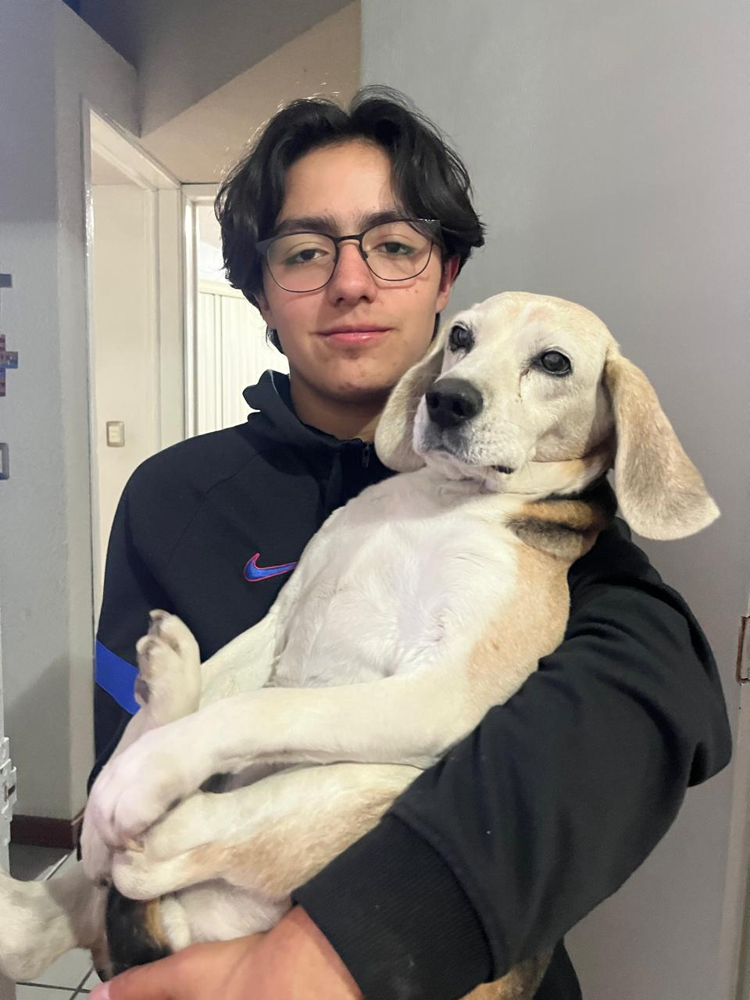

# Equipo de Trabajo.

---
- Conócenos, equipo de trabajo en Introducción a la Mecatrónica.
  
---
## José Ismael Guerrero Román.
---

---

- **Carrera:** Ing Mecatrónica
- **Cosas que me gustan hacer:** Me gusta jugar videojuegos, escuchar música y estar informado de la tecnología y de los avances que logramos con ella y finalmente, otro de mis gustos es la fórmula 1.
- **Cosas de las que estoy orgulloso:** Estoy Orgulloso, de como he crecido como persona a lo largo del tiempo y de como a pesar de mis errores y aciertos en la vida he podido, levantarme y aprender algo aunque sea mínimo, de las personas que me rodean y como en ocasiones he podido llegar a influir positivamente en ellos, tanto como amigos y familia, de igual manera estoy orgulloso, de haber podido mantener una buena trayectoria académica a lo largo de mis estudios y de poder seguir estudiando en esta etapa de mi vida.
- **Edad:** 18
- **Cumpleaños:** 23 Julio
- **Contacto:** 203563@iberopuebla.mx

---
## Gerardo Esquivel De Luna
---

  
---

- **Carrera:** Ing Mecatrónica
- **Cosas que me gustan hacer:** videojuegos, montañismo, ciclismo.
- **Cosas de las que estoy orgulloso:** De ser una persona perseverante, que no se rinde fácilmente, por haber superado momentos difíciles y seguir avanzando y por ser alguien que ayuda a los demás cuando lo necesitan.
- **Edad:** 18
- **Cumpleaños:** 18 Julio
- **Contacto:** 204655@iberopuebla.mx
  
---

