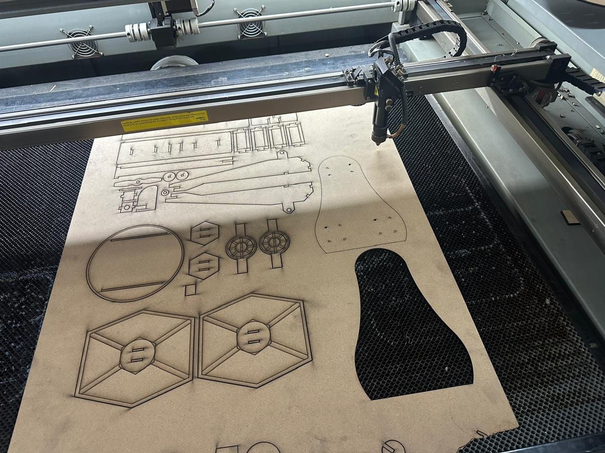

#  Proyecto Final: Carro Robot de Fútbol Controlado por PS4 (ESP32)

##  Objetivo del Proyecto

El proyecto consistió en el diseño y construcción de un **carro robot teledirigido** utilizando el microcontrolador **ESP32** y un **control PS4** (vía Bluetooth). El objetivo principal era crear una plataforma móvil con alta maniobrabilidad para participar y competir exitosamente en un torneo de fútbol de robots, moviendo una pelota y marcando goles.

---

##  Arquitectura y Tecnologías

La implementación se centró en la integración de tres áreas principales:

### Marco Teórico
* **Microcontrolador:** Se seleccionó el **ESP32** por su capacidad de doble núcleo y, fundamentalmente, por su **conectividad Bluetooth** para recibir comandos en tiempo real desde el control de PlayStation.
* **Driver de Motor:** Se utilizó un **Puente H (L298N o similar)** para gestionar la alta corriente requerida por los motores DC, ya que el ESP32 no puede alimentarlos directamente.
* **Movimiento:** Se implementó **Tracción Diferencial** mediante el envío de señales PWM (Modulación por Ancho de Pulso) a cada motor, permitiendo movimientos precisos (avance, retroceso y giros).

###  Materiales Clave
| Componente | Función Principal |
| :--- | :--- |
| **ESP32 DevKit V1** | Cerebro del sistema, gestor de Bluetooth. |
| **Puente H** | Driver de potencia para los motores. |
| **Control PS4** | Interfaz de usuario para comandos inalámbricos. |
| Pilas 3.7V / 2600 mAh | Fuente de alimentación. |
| Motores DC | Actuadores de tracción. |
| MDF / Impresión 3D | Construcción del chasis, carcasas y pala. |

---

##  Procedimiento General

El proyecto se ejecutó mediante la colaboración de equipos especializados:

1.  **Electrónica:** Diseño del diagrama del circuito, conexión del driver de motor, fusibles, baterías y cableado general.
2.  **Programación:** Desarrollo del *firmware* para la conexión Bluetooth y la lógica de control de motores, traduciendo los comandos del joystick a señales de movimiento.
3.  **Mecánica:** Diseño y ensamblaje del chasis de cuatro ruedas y la pala frontal para la interacción con la pelota.

---

##  Código de Programación (Arduino para ESP32)

Este *firmware* gestiona la conexión con el control PS4 y utiliza la lógica de tracción diferencial y ajuste de velocidad (con el gatillo R2) para el control del carro.

```cpp
/**
 * @file Robot_Futbol_PS4_ESP32.ino
 * @brief Código para controlar un carro robot de fútbol usando un ESP32 y un control PS4.
 * Incluye funciones para avance, retroceso, giros y tracción diferencial mediante Joysticks.
 */

// Bibliotecas necesarias:
#include <Arduino.h>
#include <PS4Controller.h> 

// --- Configuración de Pines y Variables ---
int enA = 25; int enB = 14; // Pines de Enable (PWM)
int IN1 = 26; int IN2 = 27; int IN3 = 32; int IN4 = 33; // Pines de Dirección
#define R 0 // Canal LEDC para Motor Derecho
#define L 1 // Canal LEDC para Motor Izquierdo
int Speed = 210; // Velocidad base inicial
int threshold = 10; // Umbral de sensibilidad para Joysticks

// --- Declaración de Funciones de Movimiento ---
void forward(); void backward(); void left(); void right(); void stop();
void setMotor(int leftMotor, int rightMotor);

// --- Setup (Configuración Inicial) ---
void setup() {
  Serial.begin(115200);
  // **IMPORTANTE**: Reemplace la MAC Address con la de su control PS4.
  PS4.begin("98:3b:8f:fc:0c:82"); 
  Serial.println("Esperando control PS4...");
  ledcAttachChannel(enA, 5000, 8, R);
  ledcAttachChannel(enB, 5000, 8, L);
  pinMode(IN1, OUTPUT); pinMode(IN2, OUTPUT);
  pinMode(IN3, OUTPUT); pinMode(IN4, OUTPUT);
  stop();
}

// --- Loop Principal (Ejecución Continua) ---
void loop() {
  if (PS4.isConnected()) {
    // 1. Ajuste de Velocidad con R2
    Speed = map(PS4.R2Value(), 0, 255, 210, 255);

    // 2. Control con D-Pad (Movimientos básicos)
    if (PS4.Up()) forward();
    else if (PS4.Down()) backward();
    else if (PS4.Left()) left();
    else if (PS4.Right()) right();

    // 3. Control con Joysticks (Tracción Diferencial)
    else {
      int lx = PS4.LStickX(); int ly = PS4.LStickY();
      int rx = PS4.RStickX(); int ry = PS4.RStickY();

      if (abs(ly) > threshold || abs(lx) > threshold || abs(ry) > threshold || abs(rx) > threshold) {
        int forwardSpeed = map(-ly, -128, 127, -Speed, Speed);
        int turnSpeed    = map(lx, -128, 127, -Speed, Speed);
        int diagX = map(rx, -128, 127, -Speed, Speed);
        int diagY = map(-ry, -128, 127, -Speed, Speed);

        // Cálculo de Tracción Diferencial
        int leftMotor = constrain(forwardSpeed + turnSpeed + diagY + diagX, -255, 255);
        int rightMotor = constrain(forwardSpeed - turnSpeed + diagY - diagX, -255, 255);
        
        setMotor(leftMotor, rightMotor);
      } else {
        stop();
      }
    }
    delay(50); 
  }
}

// --- Implementación de Funciones de Movimiento ---

void forward() {
  ledcWrite(R, Speed); ledcWrite(L, Speed);
  digitalWrite(IN1, LOW); digitalWrite(IN2, HIGH);
  digitalWrite(IN3, HIGH); digitalWrite(IN4, LOW);
}

void backward() {
  ledcWrite(R, Speed); ledcWrite(L, Speed);
  digitalWrite(IN1, HIGH); digitalWrite(IN2, LOW);
  digitalWrite(IN3, LOW); digitalWrite(IN4, HIGH);
}

void left() {
  ledcWrite(R, Speed); ledcWrite(L, Speed);
  digitalWrite(IN1, LOW); digitalWrite(IN2, HIGH);
  digitalWrite(IN3, LOW); digitalWrite(IN4, HIGH);
}

void right() {
  ledcWrite(R, Speed); ledcWrite(L, Speed);
  digitalWrite(IN1, HIGH); digitalWrite(IN2, LOW);
  digitalWrite(IN3, HIGH); digitalWrite(IN4, LOW);
}

void stop() {
  ledcWrite(R, 0); ledcWrite(L, 0);
  digitalWrite(IN1, LOW); digitalWrite(IN2, LOW);
  digitalWrite(IN3, LOW); digitalWrite(IN4, LOW);
}

void setMotor(int leftMotor, int rightMotor) {
  // Motor Izquierdo
  if (leftMotor >= 0) {
    digitalWrite(IN1, LOW); digitalWrite(IN2, HIGH);
    ledcWrite(L, leftMotor);
  } else {
    digitalWrite(IN1, HIGH); digitalWrite(IN2, LOW);
    ledcWrite(L, -leftMotor);
  }

  // Motor Derecho
  if (rightMotor >= 0) {
    digitalWrite(IN3, HIGH); digitalWrite(IN4, LOW);
    ledcWrite(R, rightMotor);
  } else {
    digitalWrite(IN3, LOW); digitalWrite(IN4, HIGH);
    ledcWrite(R, -rightMotor);
  }
}

```
##  Desempeño y Resultados de la Competencia

Los resultados validaron la robustez del diseño electrónico y la eficiencia de la programación:

* **Movilidad Verificada:** El vehículo demostró una **movilidad impecable y controlada**, respondiendo de manera inmediata a los comandos del mando PS4.
* **Ajuste Fino:** Las pruebas fueron cruciales para **calibrar la velocidad y la respuesta de los motores** y optimizar la pala frontal.
* **Victoria Confirmada:** El robot interactuó eficazmente con el balón y **anotó consistentemente**, lo que se tradujo en una **victoria en la competencia** de fútbol de robots.
* **Sinergia de Equipos:** La **integración** de las áreas de electrónica, programación y mecánica se realizó de manera fluida, culminando en un carro funcional y de alto rendimiento.

---

##  Conclusiones Finales

El proyecto fue un **éxito integral** que demostró la aplicación práctica de la ingeniería de sistemas:

* **Integración Exitosa:** Se logró una **sincronización robusta entre el hardware y el software**, estableciendo un sistema de control en tiempo real eficiente.
* **Desarrollo de Habilidades:** El proceso reforzó capacidades esenciales como la **planificación, el trabajo en equipo y la resolución de problemas técnicos**.
* **Objetivo Cumplido:** La funcionalidad del robot para **competir y jugar fútbol** fue probada con éxito, cumpliendo plenamente el objetivo inicial del proyecto.

> **Reflexión:** Este proyecto subraya el valor de la **colaboración multidisciplinaria** (combinando creatividad, ingeniería y código) como el pilar fundamental para crear un producto tangible, educativo y de alto rendimiento.

## Fotos y Videos 




<video width="400" controls>
  <source src="../recursos/imgs/vcc1.mp4" type="video/mp4">
  Tu navegador no soporta la reproducción de video.
</video>
